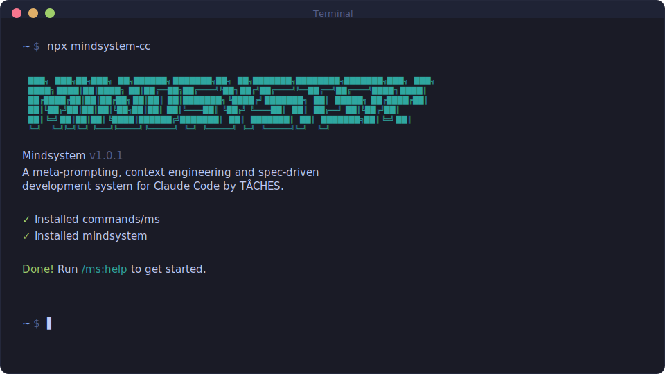

<div align="center">

# MINDSYSTEM

**Spec-driven development for Claude Code, built for engineers who ship production code.**

**Solves context rot — the quality degradation that happens as Claude fills its context window.**

_Built on the philosophy of [GSD](https://github.com/glittercowboy/get-shit-done) by TÂCHES._

[](https://www.npmjs.com/package/mindsystem-cc)
[](LICENSE)

<br>

```bash
npx mindsystem-cc
```

**Works on macOS, Windows, and Linux.**

<br>



<br>

[Why](#why-engineers-use-this) · [Install](#installation) · [Mental model](#mental-model) · [Playbooks](#playbooks) · [Why this works](#why-this-works) · [Config](#configuration) · [Commands](#command-index-one-liners) · [Troubleshooting](#troubleshooting)

</div>

---

## Why Engineers Use This

> _"I'm a solo developer. I don't write code — Claude Code does. Other spec-driven development tools exist; BMAD, Speckit... But they all seem to make things way more complicated than they need to be. I'm not a 50-person software company. I don't want to play enterprise theater. I'm just a creative person trying to build great things that work."_
>
> — **TÂCHES**, creator of the original [GSD](https://github.com/glittercowboy/get-shit-done)

This philosophy resonated. GSD proved that spec-driven development could be simple and effective.

Mindsystem takes that foundation and optimizes it for a specific kind of user: **Claude Code power users who ship production code**. You're not vibe coding. You want speed, but you also want control, reviewable diffs, and quality gates. You care about what the output code looks like.

Where GSD went broad, Mindsystem goes deep — more verification, more quality gates, more ways to inspect and override. Less magic, more engineering.

### What you get

- **Consistent quality across long sessions.** You plan in the main chat; work runs in fresh subagents at peak context quality.
- **A single source of truth.** Your `.planning/` folder holds what you're building and what you've proven works — not a scrolling chat transcript.
- **Reviewable diffs.** Every change creates a commit _and_ a `.patch` file you can inspect, apply, or throw away.
- **Smart division of labor.** Scripts handle mechanics. Models handle judgment calls and code.

### Beyond the foundation

The original GSD established the philosophy and core infrastructure. Mindsystem extends it with features you'll actually need when shipping production code:

- **Batched UAT with inline fixing.** `/ms:verify-work` shows you tests in batches, fixes failures on the spot (inline or via subagents), and loops until things pass.
- **Mock-assisted testing.** Generate mock states for tricky scenarios (errors, empty states, role-based views) without shipping mock code.
- **Patch files everywhere.** Phase execution and UAT fixes produce `.patch` files (`{phase}-changes.patch`, `{phase}-uat-fixes.patch`) so you can diff before you commit.
- **UI quality tools.** `/ms:design-phase` writes UI/UX specs. `/ms:review-design` audits existing UI and suggests improvements.
- **Fast research via CLI.** `ms-lookup` searches APIs (Context7 docs, Perplexity) with caching and JSON output. Example: `ms-lookup docs react "useEffect cleanup"`.
- **Lean milestone management.** Finishing a milestone consolidates decisions into `vX.Y-DECISIONS.md` and archives the rest, keeping `.planning/` tidy.
- **Configurable code reviews.** Reviewers run after execution and at milestone audits, creating separate commits. Milestone reviews can be report-only — you decide what gets fixed.
- **Design mockups.** `/ms:design-phase` generates parallel HTML/CSS mockup variants to explore visual directions before locking a design spec.
- **Cross-milestone learnings.** Milestone completion extracts curated patterns into `LEARNINGS.md` so planning in future milestones starts smarter.
- **Structured tech debt.** `/ms:audit-milestone` maintains `TECH-DEBT.md` — a single source of truth for debt items with severity, source, and suggested fixes.

---

## Mental Model

```
PLAN     You decide scope, design, and break work into small tasks
           ↓
EXECUTE  Fresh subagents run each task (commits + .patch files)
           ↓
VERIFY   You test manually, Mindsystem fixes inline, repeat until done
           ↓
SHIP     Audit milestone, archive decisions, start fresh
```

---

## Installation

```bash
npx mindsystem-cc
```

This adds Mindsystem slash commands to `~/.claude/` (global) or `./.claude/` (local).

Restart Claude Code after installing so it picks up the new commands, then run:

```
/ms:help
```

<details>
<summary><strong>Non-interactive install (Docker, CI, scripts)</strong></summary>

```bash
npx mindsystem-cc --global   # Install to ~/.claude/
npx mindsystem-cc --local    # Install to ./.claude/
```

</details>

<details>
<summary><strong>Staying updated</strong></summary>

Inside Claude Code:

```
/ms:release-notes
```

Or via npm:

```bash
npx mindsystem-cc@latest
```

</details>

<details>
<summary><strong>Development installation</strong></summary>

Clone and run the installer locally:

```bash
git clone https://github.com/rolandtolnay/mindsystem.git
cd mindsystem
node bin/install.js --local
```

This installs to `./.claude/` so you can test changes before contributing.

</details>

---

## Playbooks

Replace `<N>` with the phase number you're working on.

### New project (greenfield)

**When:** You're starting fresh — new repo or blank slate.

**Run:**

```
/ms:new-project
/ms:research-project        # optional (recommended when domain is new)
/ms:create-roadmap
/ms:plan-phase 1
/ms:execute-phase 1
```

**What you'll get:**

- `.planning/PROJECT.md` — vision and constraints
- `.planning/REQUIREMENTS.md` — checkable scope
- `.planning/ROADMAP.md` + `.planning/STATE.md` — plan and project memory

**Tip:** For UI-heavy phases, run `/ms:design-phase 1` before `/ms:plan-phase 1`.

### Existing project (brownfield adoption)

**When:** You have a codebase and want Mindsystem to respect its structure, conventions, and tests.

**Run:**

```
/ms:map-codebase
/ms:new-project
/ms:research-project        # optional (use for new domain areas)
/ms:create-roadmap
/ms:plan-phase 1
/ms:execute-phase 1
```

**What you'll get:**

- `.planning/codebase/*` — captured conventions and structure
- `.planning/PROJECT.md` / `.planning/REQUIREMENTS.md` / `.planning/ROADMAP.md`

### Add feature (existing product)

**When:** You already have a `.planning/` folder and want to add a traceable feature.

**Run:**

```
/ms:add-phase "Feature: <short name>"
/ms:discuss-phase <N>       # optional (lock intent before planning)
/ms:design-phase <N>        # optional (UI-heavy)
/ms:plan-phase <N>
/ms:execute-phase <N>
```

**What you'll get:**

- `.planning/ROADMAP.md` updated with the new phase
- `.planning/phases/<N>-*/<N>-01-PLAN.md` + `*-SUMMARY.md`

**Tip:** Use `/ms:insert-phase <after> "..."` instead of `/ms:add-phase` when work must happen _before_ the next planned phase.

### Work on feature (plan → execute → verify loop)

**When:** You want real confidence — implementation, review, and manual UAT.

**Run:**

```
/ms:plan-phase <N>
/ms:execute-phase <N>
/ms:verify-work <N>
```

**What you'll get:**

- `.planning/phases/<N>-*/<N>-changes.patch` — phase implementation diff
- `.planning/phases/<N>-*/<N>-VERIFICATION.md` — phase goal verification report
- `.planning/phases/<N>-*/<N>-UAT.md` + `<N>-uat-fixes.patch` — manual test log and fixes diff

**How it works:** `/ms:verify-work` fixes issues in-session (inline or via subagent), commits them as `fix(<N>-uat): ...`, and asks you to re-test.

**Tip:** For UI that works but feels off, run `/ms:review-design <scope>` to audit and improve quality.

### Fix bug

**When:** Something's broken and you want a structured investigation that survives `/clear`.

**Run:**

```
/ms:debug "Describe symptoms and what you observed"
```

**Then route the fix:**

- **Small and urgent (1–2 tasks):** `/ms:adhoc "Fix <bug>"`
- **Must happen before next phase:** `/ms:insert-phase <after> "Hotfix: <bug>"` → `/ms:plan-phase <N>` → `/ms:execute-phase <N>`
- **Belongs in current phase after verification gaps:** `/ms:plan-phase <N> --gaps` → `/ms:execute-phase <N>`

### Scope change (what to use when)

**When:** You discover new work mid-stream.

| Situation                     | Command                          |
| ----------------------------- | -------------------------------- |
| Non-urgent work for later     | `/ms:add-phase "..."`            |
| Urgent work before next phase | `/ms:insert-phase <after> "..."` |
| Task to capture for later     | `/ms:add-todo "..."`             |
| Small fix to do right now     | `/ms:adhoc "..."`              |

### Milestone ship (finishing a version)

**When:** A version is ready and you want to lock it down cleanly.

**Run:**

```
/ms:audit-milestone 1.0.0
/ms:complete-milestone 1.0.0
/ms:new-milestone "v1.1"
```

**What you'll get:**

- `.planning/milestones/v1.0/` — archived milestone (ROADMAP, REQUIREMENTS, DECISIONS, research)
- Active docs stay lean; full detail lives in the version folder

**Tip:** Milestone review can be **report-only** (e.g., Flutter structural review) so you stay in control. Create a quality phase, or accept tech debt explicitly — your call.

---

## Why This Works

**Context rot is handled structurally.** The truth lives in `.planning/` files (scope, decisions, plans, verification), not buried in a scrolling chat.

**Execution stays sharp.** Plans are small by design and run in fresh subagents, so implementation doesn't inherit long-chat drift.

**Verification is built in.** Phase verification plus `/ms:verify-work` gives you a human-in-the-loop UAT loop with inline fixes and mock support.

**Review fits your workflow.** Changes become commits and `.patch` files. Milestone reviews can be report-only when you want full control.

**Planning docs stay readable.** Milestones consolidate and archive decisions so active files don't grow forever.

---

## Configuration

Mindsystem stores project config in `.planning/config.json`.

### Code review

After `/ms:execute-phase` (and optionally `/ms:audit-milestone`), Mindsystem runs a reviewer that produces a **separate commit** for easy inspection.

```json
{
  "code_review": {
    "adhoc": null,
    "phase": null,
    "milestone": null
  }
}
```

**Options:**

| Value                     | What it does                                                   |
| ------------------------- | -------------------------------------------------------------- |
| `null`                    | Use the default (stack-aware when available)                   |
| `"ms-code-simplifier"`    | Generic reviewer — improves clarity and maintainability        |
| `"ms-flutter-simplifier"` | Flutter/Dart-specific — strong widget and Riverpod conventions |
| `"ms-flutter-reviewer"`   | Flutter structural analysis (report-only, no code changes)     |
| `"skip"`                  | Disable review for that level                                  |

**Flutter-specific tools (built-in):**

- **`ms-flutter-simplifier`** — pragmatic refactors that preserve behavior
- **`ms-flutter-reviewer`** — milestone-level structural audit with actionable report (you control the fixes)
- **`flutter-senior-review` skill** — domain principles that raise review quality beyond generic lint advice

---

## Command Index (One-Liners)

Full docs live in `/ms:help` (same content as `commands/ms/help.md`).

| Command                                  | What it does                                                  |
| ---------------------------------------- | ------------------------------------------------------------- |
| `/ms:help`                               | Show the full command reference                               |
| `/ms:progress`                           | Show where you are and what to run next                       |
| `/ms:new-project`                        | Initialize `.planning/` and capture intent                    |
| `/ms:map-codebase`                       | Document existing repo's stack, structure, and conventions    |
| `/ms:research-project`                   | Do domain research and save findings to `.planning/research/` |
| `/ms:create-roadmap`                     | Define requirements and create phases mapped to them          |
| `/ms:discuss-phase <number>`             | Lock intent and constraints before planning                   |
| `/ms:design-phase <number>`              | Generate UI/UX spec for UI-heavy work                         |
| `/ms:review-design [scope]`              | Audit and improve existing UI quality                         |
| `/ms:research-phase <number>`            | Do deep research for niche phase domains                      |
| `/ms:list-phase-assumptions <number>`    | Show what Mindsystem assumes before planning                  |
| `/ms:plan-phase [number] [--gaps]`       | Create small, verifiable plans with optional risk-based verification |
| `/ms:check-phase <number>`               | Sanity-check plans before execution                           |
| `/ms:execute-phase <phase-number>`       | Run all unexecuted plans in fresh subagents                   |
| `/ms:verify-work [number]`               | Batched manual UAT with inline fixes                          |
| `/ms:debug [issue description]`          | Structured debugging that survives `/clear`                   |
| `/ms:adhoc <description>`              | Execute a small fix now with review                           |
| `/ms:add-phase <description>`            | Append a new phase to the roadmap                             |
| `/ms:insert-phase <after> <description>` | Insert urgent work between phases                             |
| `/ms:remove-phase <number>`              | Delete a future phase and renumber                            |
| `/ms:audit-milestone [version]`          | Audit completion and surface gaps                             |
| `/ms:complete-milestone <version>`       | Archive and consolidate decisions                             |
| `/ms:new-milestone [name]`               | Discover what to build next, start new milestone              |
| `/ms:plan-milestone-gaps`                | Turn audit gaps into fix phases                               |
| `/ms:add-todo [description]`             | Capture a deferred task in `.planning/todos/`                 |
| `/ms:check-todos [area]`                 | List pending todos and route into work                        |
| `/ms:doctor`                             | Health check and fix project configuration                    |
| `/ms:release-notes`                      | Show full release notes with update status                    |

---

## Troubleshooting

**Commands not found after install?**

- Restart Claude Code to reload slash commands.
- Check that files exist in `~/.claude/commands/ms/` (global) or `./.claude/commands/ms/` (local).

**Commands not working as expected?**

- Run `/ms:help` to verify installation.
- Re-run `npx mindsystem-cc` to reinstall.

**Updating to the latest version?**

```bash
npx mindsystem-cc@latest
```

---

## License

MIT License. See [LICENSE](LICENSE) for details.

---

<div align="center">

**Claude Code is powerful. Mindsystem makes it reliable.**

</div>
