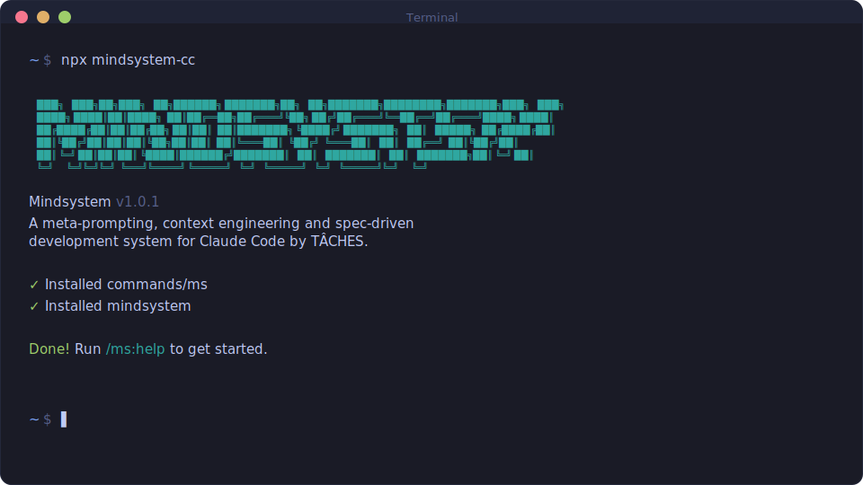

<div align="center">

# MINDSYSTEM

**The full-cycle development system for Claude Code.**

Amplifies every step of the development workflow you already follow — discovery, research, design, planning, execution, verification. Each one refined, parallelized, and compounded into persistent knowledge. Built for lean teams and solo builders who want to multiply their output without giving up control.

```bash
npx mindsystem-cc
```

[](https://www.npmjs.com/package/mindsystem-cc)
[](LICENSE)

<br>



<br>

[Why Mindsystem](#why-mindsystem) · [How it works](#how-it-works) · [Walkthrough](#end-to-end-walkthrough) · [Features](#features) · [Quick start](#quick-start) · [.planning](#the-planning-directory) · [Config](#configuration) · [Commands](#command-reference) · [Troubleshooting](#troubleshooting)

</div>

---

## Why Mindsystem

Fully autonomous coding tools take a spec and run until a product emerges. That works for prototypes. Mindsystem takes the opposite approach — it follows the workflow a thorough engineer already uses, and amplifies each step:

| What you'd do manually | What Mindsystem does |
|---|---|
| Talk through requirements, catch misalignment early | **Discuss phase** surfaces assumptions with confidence levels, forces tradeoff decisions before any code gets written |
| Google libraries, read a few docs | **Research phase** runs 3 parallel agents across documentation, your codebase, and community practices — 10x more sources, synthesized in minutes |
| Try design directions, pick the best one | **Design phase** generates parallel HTML/CSS mockups with side-by-side comparison and exact design tokens |
| Plan from what you remember about the codebase | **Plan phase** loads knowledge files capturing every decision, pattern, and pitfall from prior phases |
| Figure out what states to test, mock them manually | **Verify work** determines mock states automatically — you validate visually or programmatically |

The workflow stays yours. Each step finishes in minutes instead of hours. Everything learned compounds into knowledge that survives context resets — phase 10 starts with everything the project learned from phases 1–9.

This is not an autopilot. It's a force multiplier.

---

## How it works

```
[ new-milestone ]       Define what to build next
        │
        ▼
[ research-milestone ]  (optional) Research domain before roadmapping
        │
        ▼
[ create-roadmap ]      Derive requirements, map to phases
        │
        ▼
╔══════════════════════════════════════════════════════════════════╗
║ Per Phase:                                                       ║
║                                                                  ║
║ [ discuss-phase ]       (optional) Lock intent, validate context ║
║         │                                                        ║
║         ▼                                                        ║
║ [ design-phase ]        (optional) Generate mockups, pick path   ║
║         │                                                        ║
║         ▼                                                        ║
║ [ research-phase ]      (optional) External docs, code patterns  ║
║         │                                                        ║
║         ▼                                                        ║
║ [ plan-phase ]          Break into context-budgeted plans        ║
║         │                                                        ║
║         ▼                                                        ║
║ [ execute-phase ]       Fresh subagents run each plan            ║
║         │                                                        ║
║         ▼                                                        ║
║ [ verify-work ]         Manual acceptance tests, inline fixes    ║
║         │                                                        ║
║         └────── repeat for next phase ──────────────────────┐    ║
╚═════════╦═══════════════════════════════════════════════════╧════╝
          │
          ▼
[ audit-milestone ]     Check requirements coverage, surface tech debt
          │
          ▼
[ complete-milestone ]  Archive, evolve PROJECT.md, start fresh
```

Each phase gets its own preparation depth. A database migration might skip straight to planning. A user-facing feature might need discussion, design mockups, and research first. You pick the depth.

Execution happens in fresh subagent contexts, so each plan gets up to 200k tokens of headroom regardless of how much planning happened in the main conversation.

---

## End-to-end walkthrough

### Project setup

Before building features, initialize the project once with `/ms:new-project`. For existing codebases, also run `/ms:map-codebase` (analyzes your stack, conventions, and architecture into 7 structured documents) and `/ms:doctor` (validates config and generates per-subsystem knowledge files from source code). See [Quick start](#quick-start) for the exact sequences.

Everything below is the feature-building loop, identical for new and existing projects.

### 1. New milestone

```
/ms:new-milestone
```

Claude reads your project history (tech debt, deferred requirements, validated decisions) and surfaces strategic directions. You articulate the vision. The output is a `MILESTONE-CONTEXT.md` that grounds everything downstream.

Think of it as guided brainstorming: Claude asks the right questions rather than prescribing answers, helping you figure out what to build next.

### 2. Research milestone (optional)

```
/ms:research-milestone
```

Spawns 2-5 research agents adapted to your milestone scope — ecosystem/stack, product landscape, codebase feasibility, architecture, pitfalls. You approve which dimensions to research, then agents run in parallel.

Produces `MILESTONE-RESEARCH.md` that the roadmapper consumes for better phase breakdowns. Valuable when entering unfamiliar domains, evaluating new tech stacks, or starting a project's first milestone.

### 3. Create roadmap

```
/ms:create-roadmap
```

Claude derives requirements from your milestone context, assigns each a `REQ-ID`, and maps them to phases with success criteria. You approve scope and phase grouping.

Requirements define what must be TRUE when you ship, not what to build. This goal-backward framing means verification checks outcomes, not task completion.

**Creates:** `REQUIREMENTS.md`, `ROADMAP.md`, `STATE.md`, phase directories.

### 4. Discuss phase (optional, recommended)

```
/ms:discuss-phase 1
```

This is where you catch misalignment before writing any code. Claude loads milestone context, feature knowledge files, and competitor research, then surfaces its assumptions with confidence levels. You validate intent, make tradeoff decisions, correct misunderstandings.

Worth taking seriously. Decisions here propagate through everything that follows.

**Creates:** `CONTEXT.md` with vision, essentials, and reasoning-backed decisions.

### 5. Design phase (optional)

```
/ms:design-phase 1
```

Claude generates parallel HTML/CSS mockup variants and a side-by-side comparison page that opens in your browser. You pick a direction, iterate with feedback.

The output is a `DESIGN.md` with exact design tokens (hex colors, px spacing, font weights), not descriptions of what things should look like.

### 6. Research phase (optional)

```
/ms:research-phase 1
```

Three parallel agents investigate at once: one queries external documentation through Perplexity and Context7, one analyzes your codebase for existing patterns, one surveys community best practices. Claude synthesizes findings into `RESEARCH.md` with confidence levels and source attribution.

You resolve library conflicts if any come up. Otherwise, this runs with minimal input.

### 7. Plan phase

```
/ms:plan-phase 1
```

Claude breaks the phase into tasks and writes a single PLAN.md — pure markdown, no YAML frontmatter, no XML containers. The plan is the executable prompt, roughly 90% actionable content and 10% structure.

A risk score (0-100) flags complex plans so you can verify them before committing. For phases with genuinely independent work streams, enable `multi_plan` in config to restore multi-plan breakdown with wave-based parallel execution.

**Creates:** `PLAN.md` files, `EXECUTION-ORDER.md`.

### 8. Execute phase

```
/ms:execute-phase 1
```

Runs without intervention. Each plan runs in a fresh subagent with the full context window available. Goal-backward verification checks that the phase achieved its intended outcome, not just that tasks got marked complete.

For web projects, browser verification launches a real browser against your dev server, derives a checklist from execution summaries, and verifies each route visually and programmatically. Clear mismatches get fixed inline; issues beyond visual fixes are reported with screenshot evidence for verify-work.

Configurable code review produces separate commits for review changes. Patch files are generated for manual inspection.

After execution, knowledge consolidation updates subsystem-scoped knowledge files. Future phases touching the same subsystems start with accumulated context: decisions made, patterns established, pitfalls encountered.

**Creates:** `SUMMARY.md`, `VERIFICATION.md`, `.patch` files, screenshots, knowledge file updates.

### 9. Verify work

```
/ms:verify-work 1
```

You run manual acceptance tests presented in batches of 4. Claude fixes issues inline or via subagent, then asks you to re-test until passing.

For hard-to-test scenarios (error states, loading screens, role-based views), mock generation creates temporary inline states without shipping test infrastructure.

Fixes compound into knowledge files through automatic consolidation. This is where edge cases, UI tweaks, and small bugs get caught before moving on.

**Creates:** `UAT.md`, `uat-fixes.patch`, knowledge file updates.

### 10. Repeat

Run steps 4-9 for each phase. Pick the preparation depth each phase needs.

### 11. Audit milestone

```
/ms:audit-milestone
```

Claude checks requirements coverage against `REQ-IDs`, verifies cross-phase wiring from verification artifacts, aggregates untested UAT assumptions, and consolidates tech debt into `TECH-DEBT.md` with severity tiers and `TD-IDs`.

Optional code review with quality-phase decisions for high-impact findings. You decide what gets fixed vs. accepted as debt.

### 12. Complete milestone

```
/ms:complete-milestone
```

Full `PROJECT.md` evolution: validates core value proposition, moves shipped requirements to validated, triages deferred items. Archives the milestone to `.planning/milestones/{name}/` with the roadmap, requirements, and phase summaries.

Updates `MILESTONES.md` with stats and accomplishments. Fresh start for the next `/ms:new-milestone`.

---

## Features

### Knowledge compounding

This is the thing that makes the whole system worth using. Subsystem-scoped knowledge files get enriched after every phase. Execute-phase consolidates implementation decisions. Verify-work compounds fixes and edge cases. `/ms:compound` catches out-of-pipeline work like direct Claude sessions, manual edits, or merged branches.

Phase 1 starts from scratch. Phase 10 starts with a knowledge base that knows what works, what failed, and why.

### Context budget management

Plans target 25-45% of the context window. Execution runs in fresh subagents with no inherited drift from long planning conversations. The 50% rule ensures plans complete before quality degrades.

Orchestration metadata (wave grouping, dependencies) lives in `EXECUTION-ORDER.md`, separate from plans. Plans carry only what the executor needs: context, changes, verification, must-haves.

### Research-backed prompts

Unnecessary instructions aren't wasted space — they interfere with the ones that matter. Each instruction passes a reliability test: does removing this degrade output in the actual runtime context? Every command, workflow, and agent definition gets audited to cut that interference. Audited agents show 35-39% context reduction with no behavioral regression.

### Browser verification

During execute-phase, web projects get automatic visual QA via [agent-browser](https://github.com/anthropics/agent-browser). A checklist is derived from execution summaries, then each route is verified with screenshots and programmatic diagnostics (console logs, JS errors, network failures). Clear mismatches get fixed inline; anything deeper is reported with screenshot evidence for verify-work. Enabled by default — disable per-project via `/ms:config`.

### Built-in code review

Configurable per tier: adhoc, phase, or milestone. Runs after execution and produces separate commits for inspection. Ships with structural analysis (`ms-code-reviewer`) and clarity-focused simplification (`ms-code-simplifier`), but you can point any tier at your own custom reviewer agent via `.planning/config.json`.

### Structured debugging

`/ms:debug` creates investigation state that persists across `/clear`. Scientific method: gather evidence, form hypotheses, test. Resume any debug session by running `/ms:debug` with no arguments. Archives resolved issues to `.planning/debug/resolved/`.

### Adhoc execution

For work that's too coherent for a todo but too small for a full phase. `/ms:adhoc` reads existing knowledge files, generates a plan, executes, reviews, and consolidates learnings in one context. Accepts Linear ticket IDs, todo file paths, or plain descriptions.

### Design mockups

`/ms:design-phase` generates parallel HTML/CSS variant mockups with a side-by-side comparison page. Design tokens in the output are exact values (hex, px, font-weight), not descriptions. `/ms:review-design` audits existing screens using screenshots for retroactive design improvement.

### Project health

`/ms:doctor` runs 10 health checks: subsystem vocabulary, directory structure, milestone naming, knowledge files, CLI wrappers, API keys, version freshness. Fixes are applied in dependency order with atomic commits. Safe to run repeatedly.

### Smart routing

`/ms:progress` reads project state and tells you what to run next. Visual progress bar, recent work summary, pending todos, active debug sessions. Reconstructs `STATE.md` from artifacts if it's missing. Also detects available updates.

### Deferred requirements

Requirements you want but haven't shipped yet are tracked in `PROJECT.md` with origin milestone and deferral reason. `complete-milestone` triages them before archiving. `create-roadmap` picks them up as candidates for new milestones. They don't get lost.

### Task capture

`/ms:add-todo` with Linear-inspired metadata: priority (1-4), estimate (XS-XL), inferred subsystem. Todos live as flat files in `.planning/todos/`. Address them later via `/ms:adhoc`, which reads the problem description, executes the work, and moves the todo to `done/`.

### Codebase mapping

`/ms:map-codebase` spawns 4 parallel agents producing 7 structured documents: stack, architecture, conventions, testing, integrations, directory structure, and concerns. Use on brownfield projects so Mindsystem respects your existing patterns.

---

## Prerequisites

- [Claude Code](https://docs.anthropic.com/en/docs/claude-code)
- [Node.js](https://nodejs.org/) (for `npx`)
- [uv](https://docs.astral.sh/uv/) — Python package runner used by CLI scripts (`curl -LsSf https://astral.sh/uv/install.sh | sh`)
- Python 3.10+ (used by uv for scripts)

**Optional (for web projects):**

- [agent-browser](https://github.com/anthropics/agent-browser) — enables browser verification during execute-phase (`npm install -g agent-browser`)
- `cwebp` — optimizes verification screenshots to WebP (`brew install webp`)

---

## Quick start

### Project setup (one-time)

**New project:**

```
/ms:new-project
```

**Existing codebase:**

```
/ms:new-project                 # Business context and vision
/ms:map-codebase                # Analyze code → 7 structured documents
/ms:doctor                      # Validate config, generate knowledge files
```

Optional: `/ms:config` — configure code reviewers, gitignore, and other preferences.

### Building features

Once the project is set up, the workflow is the same for new and existing codebases:

```
/ms:new-milestone               # Discover what to build next
/ms:create-roadmap              # Define requirements, map to phases
/ms:plan-phase 1                # Create detailed plan
/ms:execute-phase 1             # Run in fresh subagents
/ms:verify-work 1               # Manual acceptance testing
```

Repeat for each milestone. All downstream planning automatically loads codebase docs and knowledge files.

**Returning after a break?** Run `/ms:progress` to see where you left off and what to do next.

---

## The .planning directory

Every artifact Mindsystem generates lives in `.planning/` — a markdown knowledge base that grows with your project. Commands read from it, execution enriches it, and it all survives `/clear` boundaries and context resets. Here's what a project looks like after a couple of milestones:

```
.planning/
├── PROJECT.md                        # Living spec — vision, users, flows, decisions
├── MILESTONES.md                     # Registry of completed milestones
│
├── STATE.md                          # Active phase, blockers, recent decisions
├── MILESTONE-CONTEXT.md              # new-milestone → brainstorm that grounds the roadmap
├── MILESTONE-RESEARCH.md             # research-milestone → domain research before roadmapping
├── ROADMAP.md                        # Phase breakdown with goals and success criteria
├── REQUIREMENTS.md                   # Checkable REQ-IDs mapped to phases
│
├── TECH-DEBT.md                      # Prioritized debt — TD-IDs, severity tiers
├── config.json                       # Subsystems, code review tiers, preferences
│
├── knowledge/                        # Persists across milestones
│   ├── auth.md                       # Patterns, decisions, pitfalls per subsystem
│   ├── api.md                        # Enriched after every execute and verify cycle
│   └── ui.md                         # Future phases load relevant files automatically
│
├── codebase/                         # /ms:map-codebase → existing repo analysis
│   ├── STACK.md                      # Runtime, frameworks, key dependencies
│   ├── ARCHITECTURE.md               # Modules, layers, data flow patterns
│   ├── STRUCTURE.md                  # Directory layout and file organization
│   ├── CONVENTIONS.md                # Naming, style, established patterns
│   ├── TESTING.md                    # Test framework, coverage, how to add tests
│   ├── INTEGRATIONS.md               # External services and API connections
│   └── CONCERNS.md                   # Known issues, areas requiring care
│
├── phases/                           # Active milestone work
│   │
│   ├── 01-auth-foundation/           # ── Fully executed phase ──
│   │   ├── CONTEXT.md                # discuss-phase → locked intent and decisions
│   │   ├── DESIGN.md                 # design-phase → exact tokens, layout, interactions
│   │   ├── RESEARCH.md               # research-phase → library picks, patterns, tradeoffs
│   │   ├── 01-01-PLAN.md             # plan-phase → executable prompt, one per budget slice
│   │   ├── 01-02-PLAN.md             #
│   │   ├── EXECUTION-ORDER.md        # plan-phase → wave grouping and dependencies
│   │   ├── 01-01-SUMMARY.md          # execute-phase → what changed, patterns, learnings
│   │   ├── 01-02-SUMMARY.md          #
│   │   ├── VERIFICATION.md           # execute-phase → goal-backward pass/fail
│   │   ├── UAT.md                    # verify-work → manual acceptance test results
│   │   ├── 01-changes.patch          # execute-phase → diff of all code changes
│   │   ├── 01-uat-fixes.patch        # verify-work → diff of fixes applied during testing
│   │   └── mockups/                  # design-phase → HTML/CSS design exploration
│   │       ├── variant-a.html        #   self-contained mockup
│   │       ├── variant-b.html        #   self-contained mockup
│   │       └── comparison.html       #   side-by-side view, opens in browser
│   │
│   └── 02-payment-flow/              # ── Phase in progress ──
│       ├── CONTEXT.md                #   discussed, not yet planned
│       └── 02-01-PLAN.md             #   planned, not yet executed
│
├── adhoc/                            # /ms:adhoc → out-of-pipeline work
│   └── 2026-01-15-fix-token/
│       ├── adhoc-01-SUMMARY.md       # Execution results and learnings
│       └── adhoc-01-changes.patch    # Code diff
│
├── debug/                            # /ms:debug → structured investigations
│   ├── websocket-reconnect.md        # Active investigation — survives /clear
│   └── resolved/
│       └── race-condition-login.md   # Root cause found, fix documented
│
├── todos/                            # /ms:add-todo → captured work items
│   ├── 2026-02-01-rate-limiting.md   # Pending — priority, estimate, subsystem
│   └── done/
│       └── 2026-01-20-header-fix.md  # Completed via /ms:adhoc
│
└── milestones/                       # /ms:complete-milestone → archived history
    └── mvp/
        ├── ROADMAP.md                # Historical phase breakdown
        ├── REQUIREMENTS.md           # Final requirement status
        ├── PHASE-SUMMARIES.md        # Consolidated execution summaries
        ├── MILESTONE-AUDIT.md        # Requirements coverage, cross-phase wiring check
        ├── CONTEXT.md                # Original milestone brainstorm
        ├── MILESTONE-RESEARCH.md     # Archived domain research (if existed)
        └── phases/                   # Archived phase artifacts
            └── 01-foundation/
                ├── 01-changes.patch  #   code diffs retained
                └── mockups/          #   design mockups retained
                    └── ...
```

Everything is plain markdown (plus `config.json` and `.patch` diffs). The entire directory is greppable, diffable, and readable by any team member or AI assistant. Phase 1 starts from scratch. Phase 10 starts with everything the project has learned.

---

## Configuration

Mindsystem stores project config in `.planning/config.json`. Run `/ms:config` to change these interactively.

```jsonc
{
  // Canonical subsystem names. Drives knowledge file scoping.
  // Populated by /ms:new-project, refined by /ms:doctor.
  "subsystems": ["auth", "api", "database"],

  // Code review after execution. One reviewer per tier.
  //   null                  → falls back to "ms-code-simplifier" (default)
  //   "ms-code-reviewer"    → structural: architecture and design issues
  //   "ms-code-simplifier"  → clarity: readability and maintainability
  //   "skip"                → explicitly disable review
  //   "<custom-agent>"      → your own reviewer agent
  "code_review": {
    "adhoc": null,
    "phase": null,
    "milestone": null
  },

  // How /ms:design-phase opens the mockup comparison page.
  //   "auto" (default) | "ask" | "off"
  "open_mockups": "auto",

  // Browser verification during execute-phase (web projects only).
  //   Launches a real browser, derives checklist from summaries,
  //   screenshots + console/network diagnostics.
  "browser_verification": {
    "enabled": true   // default: true for web projects
  },

  // Plan mode for plan-phase.
  //   false (default) → single plan per phase, optimal for 1M context
  //   true            → multi-plan with wave-based parallel execution
  "multi_plan": false,

  // External task tracker integration (Linear only for now).
  //   null → disabled (default)
  "task_tracker": {
    "type": "linear",
    "cli": "path/to/linear-cli"
  }
}
```

Linear integration requires the [Linear CLI skill](https://github.com/rolandtolnay/llm-toolkit/tree/main/skills/linear). Point `task_tracker.cli` at the downloaded script.

---

## Command reference

Full docs live in `/ms:help`.

| Command | What it does |
| ------- | ------------ |
| `/ms:help` | Show the full command reference |
| `/ms:progress` | Show where you are and what to run next |
| `/ms:new-project` | Initialize `.planning/` and capture project intent |
| `/ms:config` | Configure code reviewers, mockups, plan mode, gitignore, git remote |
| `/ms:map-codebase` | Document existing repo's stack, structure, and conventions |
| `/ms:research-milestone` | Milestone-scoped research saved to `.planning/MILESTONE-RESEARCH.md` |
| `/ms:create-roadmap` | Define requirements and create phases mapped to them |
| `/ms:new-milestone [name]` | Discover what to build next, start new milestone |
| `/ms:discuss-phase <number>` | Product-informed collaborative thinking before planning |
| `/ms:design-phase <number>` | Generate UI/UX spec and optional HTML mockups |
| `/ms:review-design [scope]` | Audit and improve existing UI quality |
| `/ms:research-phase <number>` | Deep research for niche phase domains |
| `/ms:plan-phase [number]` | Create context-budgeted plans with optional risk scoring |
| `/ms:execute-phase <number>` | Run all unexecuted plans in fresh subagents |
| `/ms:verify-work [number]` | Batched manual UAT with inline fixes |
| `/ms:debug [description]` | Structured debugging that survives `/clear` |
| `/ms:adhoc <description>` | Knowledge-aware execution for discovered work |
| `/ms:compound [input]` | Compound out-of-pipeline changes into knowledge files |
| `/ms:add-phase <description>` | Append a new phase to the roadmap |
| `/ms:insert-phase <after> <description>` | Insert urgent work between phases |
| `/ms:remove-phase <number>` | Delete a future phase and renumber |
| `/ms:add-todo [description]` | Capture a task with priority, estimate, subsystem |
| `/ms:audit-milestone [name]` | Audit completion and surface gaps |
| `/ms:complete-milestone [name]` | Archive milestone and prepare for next |
| `/ms:doctor` | Health check and fix project configuration |
| `/ms:update` | Check for and install latest version |
| `/ms:release-notes` | Show full release notes with update status |

---

## Updating

Inside Claude Code:

```
/ms:update
```

Check what changed:

```
/ms:release-notes
```

From your terminal:

```bash
npx mindsystem-cc@latest
```

---

## Troubleshooting

**Commands not found after install?**

- Restart Claude Code to reload slash commands.
- Check that files exist in `~/.claude/commands/ms/` (global) or `./.claude/commands/ms/` (local).

**Commands not working as expected?**

- Run `/ms:help` to verify installation.
- Re-run `npx mindsystem-cc` to reinstall.

**Outdated project structure after a major update?**

- Run `/ms:doctor` to detect and fix stale artifacts, missing config fields, and directory structure changes between versions.

**Updating to the latest version?**

```bash
npx mindsystem-cc@latest
```

---

## License

MIT License. See [LICENSE](LICENSE) for details.

---

Originally rooted in [GSD](https://github.com/gsd-build/get-shit-done), now an independent system with its own philosophy. Knowledge compounding inspired by [Compound Engineering](https://github.com/EveryInc/compound-engineering-plugin).
